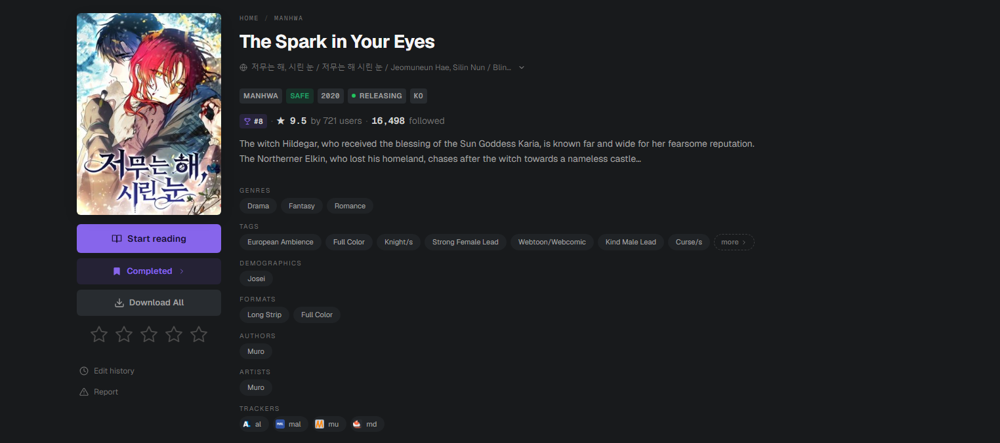
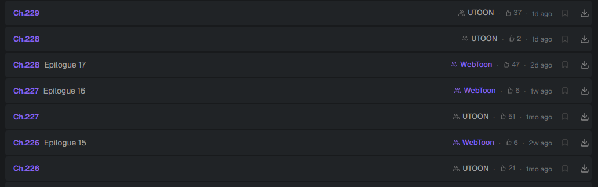
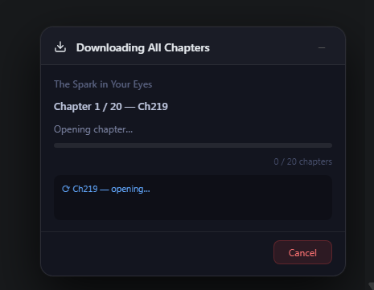

<div align="center">

# Comix Downloader

### Download your mangas from [comix.to](https://comix.to) 

[](https://chromewebstore.google.com/detail/nojjjpmicodkodnnllbdolpglhlclpdp)
[](https://addons.mozilla.org/en-US/firefox/addon/comix-chapter-downloader/)
[](https://developer.chrome.com/docs/extensions/mv3/intro/)
[](LICENSE)
[](https://github.com/N3uralCreativity/comix-downloader)


**by [N3uralCreativity](https://github.com/N3uralCreativity)**

**[Checkout the Site for a more User-Friendly interface](https://n3uralcreativity.github.io/comix-downloader/index.html)**


If the download buttons aren't showing up, just refresh the page. Your browser tends to load pages from cache sometimes, which can prevent the extension from being triggered properly. Not really much I can do about that unfortunately.


</div>

---

## What it does

Adds download buttons directly to every comix.to title page — grab a single chapter or the entire series, all neatly zipped and organized.

---

## Download an entire series in one click

Hit **Download All** on any title page. Every chapter is downloaded, packaged into its own folder, and bundled into a single ZIP — named, padded, and sorted.

 (peak Manhwa btw)

---

## Or pick individual chapters

Each chapter gets its own download button right in the list.



---

## Live progress for series download



### > **WARNING**: During download sessions, the extension automatically opens and closes background browser tabs to extract each chapter. This is completely normal behaviour. Your current tab is never touched, but you may notice tabs briefly appearing in your taskbar. **Do not close the browser while a download is in progress.**

---

## Mobile support (Android)

### Option A — Mihon (recommended for offline reading)

[Mihon](https://mihon.app/) you get the **exact same download capability** as the PC extension:

- **Download All chapters** : open any title → tap the **⋮** menu → **Download** → **All** (or Next / Unread / Custom range)
- **Per-chapter download** : tap the download icon on a chapter row, or long-press to multi-select
- Monitor / pause / reorder downloads from **More → Download queue**
- Files land under `Mihon/downloads/Comix/<Manga>/<Chapter>/` for offline reading

#### One-tap install (auto-updates)

1. Install [Mihon](https://mihon.app/download) on your Android device.
2. Open Mihon → **More** → **Settings** → **Browse** → **Extension repos**.
3. Tap **+** and paste this URL:
   ```
   https://raw.githubusercontent.com/n3uralcreativity/comix-downloader/repo/index.min.json
   ```
4. Go to **Browse** → **Extensions** → install **Comix**.
5. Open **Browse** → **Comix** and start reading or downloading.

Mihon will fetch new versions automatically whenever a new release is published here.

#### Manual APK install (one-off)

1. Grab `comix-mihon-vX.Y.Z.apk` from [Releases](https://github.com/N3uralCreativity/comix-downloader/releases).
2. Install on your phone (allow unknown app installs if prompted).
3. Open Mihon → **Browse** → **Comix**.

### Option B — Kiwi Browser (browser-extension parity)

If you specifically want the in-page buttons that the desktop extension provides, the WebExtension works as-is on Android via **[Kiwi Browser](https://play.google.com/store/apps/details?id=com.kiwibrowser.browser)**:

**Easiest:** open the [Chrome Web Store listing](https://chromewebstore.google.com/detail/nojjjpmicodkodnnllbdolpglhlclpdp) in Kiwi and tap **Add to Chrome** — Kiwi installs Chrome Web Store extensions directly.

Or load it unpacked:

1. Install [Kiwi Browser](https://play.google.com/store/apps/details?id=com.kiwibrowser.browser) from the Play Store.
2. On your phone, download this repo ZIP and extract it.
3. Open Kiwi → go to `chrome://extensions`.
4. Toggle **Developer mode** on.
5. Tap **Load unpacked (zip or folder)** → select the extracted folder.
6. Head to any [comix.to](https://comix.to) title page — buttons appear automatically.

### Option C — Firefox Android add-on
[](https://addons.mozilla.org/en-US/firefox/addon/comix-chapter-downloader/)

> iOS is not supported (Safari doesn't allow extension-based downloads) - sorry its essentially impossible.. at least i can't :c

---
## PC support

### Firefox

[](https://addons.mozilla.org/en-US/firefox/addon/comix-chapter-downloader/)

### Chrome

[](https://chromewebstore.google.com/detail/nojjjpmicodkodnnllbdolpglhlclpdp)

The extension is on the **Chrome Web Store** — one click to install.

1. Open the [Chrome Web Store listing](https://chromewebstore.google.com/detail/nojjjpmicodkodnnllbdolpglhlclpdp).
2. Click **Add to Chrome** and confirm the permissions prompt.
3. Head to any [comix.to](https://comix.to) title page — buttons appear automatically.

<details>
<summary>Or install manually (unpacked / developer mode)</summary>

1. [Download this repo](https://github.com/N3uralCreativity/comix-downloader/archive/refs/heads/master.zip) and unzip it
2. Open Chrome → go to `chrome://extensions`
3. Toggle **Developer mode** on (top-right)
4. Click **Load unpacked** → select the unzipped folder
5. Head to any [comix.to](https://comix.to) title page — buttons appear automatically

</details>

---

## License

MIT © [N3uralCreativity](https://github.com/N3uralCreativity)
